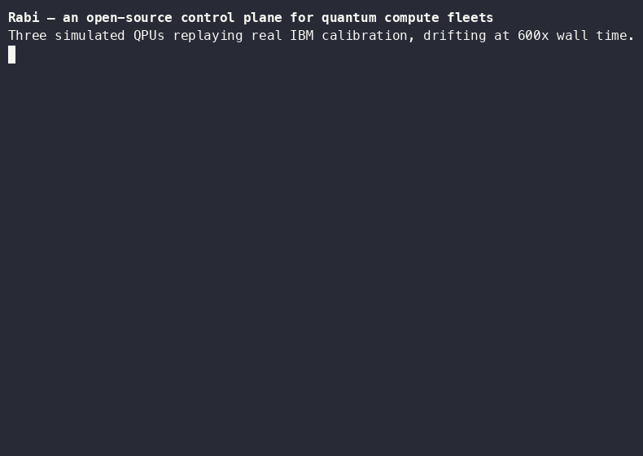

<picture>
  <source media="(prefers-color-scheme: dark)" srcset="docs/brand/rabi-logo-dark.svg">
  
</picture>

Rabi (named for the Rabi oscillation) is an open-source control plane for
quantum compute fleets, implementing the Rabi specification. You declare
a `QuantumJob` — what to run, how good the result must be, by when, and at what
cost — and Rabi places it across a heterogeneous fleet of QPUs, simulators,
and vendor cloud queues, using each device's *current calibration* to decide
where the job will actually succeed. Every placement is recorded with a
human-readable reason, so scheduling is arguable instead of magic.

Under the hood: one control-plane binary (`rabi`) backed by PostgreSQL, a
gRPC adapter protocol any vendor can implement out of process, a `qctl` CLI,
and a calibration-replay simulator fleet that reproduces real device drift
offline — the same machinery behind our public benchmark of calibration-aware
placement against today's static device selection.

**Five-minute demo:** `make compose-up && ./deploy/compose/seed.sh` starts a
control plane managing three simulated QPUs that replay **real IBM device
calibration** (drifting at 600× wall time) and routes a 20-job mix across
them by live calibration quality — watch it with `qctl watch --all`.
**The number:** `make bench` reproduces our benchmark of calibration-aware
placement against static best-device selection — real calibration baselines,
seeded synthetic drift, exact simulator ground truth, byte-identical reruns.

**Naming:** the project is **Rabi**; the wire contracts it implements come
from the vendored [Rabi spec](spec/) (`tangle.adapter.v1alpha1`,
`tangle.api.v1alpha1`, proto packages) — the spec is law, so
spec-derived identifiers keep their names (docs/decisions.md D-028).

**Status:** Phase 1 (pilot-grade alpha) complete on `main` — OIDC + token
auth, org/project tenancy with quotas and fair-share, DB-enforced
append-only accounting, Helm + air-gapped install, spec v0.2 semantics,
sessions, five conformance-certified adapters (Aer, IBM, QRMI, QDMI, IQM),
a read-only console, and the pilot package (probes, dashboards, CVE-gated
releases). See `phase1-build-plan.md` and `docs/decisions.md`.

- [Documentation](docs/) — concepts, quickstart, job & CLI & API references, ops
- [Concepts](docs/concepts.md) — the mental model, start here
- [Quickstart](docs/quickstart.md) — clone to routed jobs in 5 commands
- [QuantumJob reference](docs/quantumjob-reference.md) · [qctl reference](docs/qctl-reference.md) · [API guide](docs/api-guide.md)
- [Architecture](docs/architecture.md) · [Decisions log](docs/decisions.md)
- Spec (vendored, read-only): [`spec/`](spec/)

## License

Apache-2.0. See [LICENSE](LICENSE) and [CONTRIBUTING.md](CONTRIBUTING.md) (DCO).
