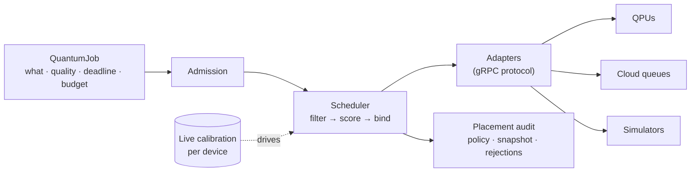

<div align="center">

<picture>
  <source media="(prefers-color-scheme: dark)" srcset="docs/brand/rabi-logo-dark.svg">
  
</picture>

### A control plane for quantum compute fleets

Declare **what** to run, **how good** the result must be, **by when**, and **at what cost** —
Rabi places it on the device where it will actually succeed, and tells you **why**.

[](https://github.com/rabi-project/rabi/actions/workflows/ci.yml)
[](https://github.com/rabi-project/rabi/releases/latest)
[](https://rabi-project.github.io/rabi/)
[](LICENSE)

[**Docs**](https://rabi-project.github.io/rabi/) ·
[**Concepts**](https://rabi-project.github.io/rabi/concepts/) ·
[**Quickstart**](https://rabi-project.github.io/rabi/quickstart/) ·
[**Install**](https://rabi-project.github.io/rabi/install/) ·
[**CLI**](https://rabi-project.github.io/rabi/qctl-reference/) ·
[**API**](https://rabi-project.github.io/rabi/api-guide/)

</div>

---

## Why Rabi

A quantum device is not a fixed thing. Its two-qubit gate error, readout error, and
which qubits are usable all **drift** — the best device this morning can be mediocre
this afternoon after a recalibration. Most people pick a device by its *advertised*
specs and hope.

Rabi reads each device's **live calibration** at the moment of placement and asks, for
*your* specific job: which device, right now, gives this the best chance of a good
result? Then it records its reasoning — the policy, the calibration snapshot, the
predicted quality, and **every rejected device with the reason** — so scheduling is
*arguable*, not magic.

> [!NOTE]
> In our public benchmark, calibration-aware placement reaches **0.407** mean fidelity
> vs **0.349** for static best-device selection, with **0%** quality-SLO violations vs
> 9.4% — on real IBM calibration data with exact simulator ground truth.

## Install

```sh
# the qctl client — macOS & Linux
curl -fsSL https://rabi-project.github.io/rabi/install.sh | sh

# or Homebrew
brew install rabi-project/tap/qctl

# or Go
go install github.com/rabi-project/rabi/cmd/qctl@latest
```

Point it at a fleet and go:

```sh
export RABI_SERVER=your-fleet:9090
export RABI_TOKEN=<api token>      # or: qctl login
qctl targets                       # live calibration state, per device
```

## Try it in five minutes

Spin up a control plane managing three simulated QPUs that **replay real IBM device
calibration** (drifting at 600× wall-clock) and watch jobs route by live quality:

```sh
git clone https://github.com/rabi-project/rabi && cd rabi
make compose-up            # control plane + 3 replay QPUs
./deploy/compose/seed.sh   # submit a 20-job mix
RABI_TOKEN=dev-key qctl watch --all
```

Then open the read-only console at **http://localhost:8080/console/** to see the fleet,
the jobs, and the *"why did my job land there"* placement-audit page.

## How it works



You submit a declarative **QuantumJob**. Rabi admits it, then the scheduler filters the
fleet to feasible devices, scores them on live calibration, and binds the best — writing
a placement audit before anything runs. Every vendor is fronted by an **adapter** that
speaks one gRPC protocol, so any device can join without changing Rabi. One control-plane
binary (`rabi`), PostgreSQL for state, a `qctl` CLI, and a read-only web console.

<details>
<summary><b>A job, and the audit it produces</b></summary>

```yaml
# bell.yaml
apiVersion: tangle.dev/v1alpha1
kind: QuantumJob
metadata: { name: bell, tenant: acme/qa }
spec:
  workload:
    kind: gate-model
    gateModel:
      program: { format: openqasm3, inline: <base64 OpenQASM 3> }
      shots: 1000
  requirements:
    quality:
      gateModel: { twoQubitErrorMax: 0.006, aggregate: best }
  deadline: "2026-07-20T09:00:00+09:00"
  scheduling: { onConflict: prefer-quality }
```

```console
$ qctl submit -f bell.yaml
$ qctl get <id>
status:
  phase: SUCCEEDED
  boundTarget: sim/ibm-sherbrooke-r
  placement:
    policy: calib-aware/v0
    calibrationSnapshot: ibm-sherbrooke-2026-07-19T…
    predicted: { successProbability: 0.58 }
    reason: "selected sim/ibm-sherbrooke-r among 3 feasible target(s)"
    rejected:
      - { target: sim/ibm-torino-r, reason: "best two-qubit error 0.0071 exceeds floor 0.006" }
```

Constraints are yours: quality floors, deadlines, and how to resolve a conflict between
them (`prefer-quality` / `prefer-deadline` / `reject`) are all declared, and the outcome
is recorded. Rabi never quietly trades one of your constraints away.
See the [QuantumJob reference](https://rabi-project.github.io/rabi/quantumjob-reference/).

</details>

## What's in the box

| | |
|---|---|
| 🎯 **Calibration-aware scheduling** | filter → score → bind on live device calibration, with quality floors, deadlines, and explicit conflict policies |
| 🔍 **Auditable placement** | every decision records the policy, snapshot, prediction, and each rejected device's reason |
| 🔐 **AuthN/Z & tenancy** | OIDC + hashed API tokens, four roles, org/project quotas, fair-share, append-only audit log |
| 🧾 **Accounting** | DB-enforced append-only usage ledger with replayable cost normalization |
| 🔌 **Five certified adapters** | Aer, IBM, QRMI, QDMI, IQM — plus a conformance harness to certify your own |
| 🖥️ **Read-only console** | fleet view, job explorer, and the placement-audit "why here" page |
| 📦 **Real deployment** | Helm chart, air-gapped bundle, backup/restore drill, probes, Grafana, CVE-gated releases |

<details>
<summary><b>Deploy a control plane</b></summary>

The server side needs Postgres and adapters — deploy with Helm or Docker Compose (see the
[site install guide](https://rabi-project.github.io/rabi/site-install-guide/)), or pull the
published image:

```sh
docker pull ghcr.io/rabi-project/rabi:latest
helm install rabi deploy/helm/rabi --set auth.bootstrapToken="$(openssl rand -hex 24)"
```

Air-gapped installs, backup/restore, and the security checklist are all documented.

</details>

<details>
<summary><b>Write an adapter for your device</b></summary>

Any process that speaks the `tangle.adapter.v1alpha1` gRPC protocol can join a fleet.
Certify it — declaring a capability obligates passing its tests:

```sh
rabi-conformance run --target localhost:50051
```

Guide: [Conformance for driver authors](https://rabi-project.github.io/rabi/conformance-authors/).

</details>

## Documentation

Everything lives at **[rabi-project.github.io/rabi](https://rabi-project.github.io/rabi/)** —
searchable, with these entry points:

| Learn & use | Operate | Extend |
|---|---|---|
| [Concepts](https://rabi-project.github.io/rabi/concepts/) | [Install a fleet](https://rabi-project.github.io/rabi/site-install-guide/) | [Write an adapter](https://rabi-project.github.io/rabi/conformance-authors/) |
| [Quickstart](https://rabi-project.github.io/rabi/quickstart/) | [Security checklist](https://rabi-project.github.io/rabi/security-checklist/) | [QDMI site recipe](https://rabi-project.github.io/rabi/qdmi-site-recipe/) |
| [QuantumJob reference](https://rabi-project.github.io/rabi/quantumjob-reference/) | [Backup & restore](https://rabi-project.github.io/rabi/backup-restore/) | [Architecture](https://rabi-project.github.io/rabi/architecture/) |
| [qctl reference](https://rabi-project.github.io/rabi/qctl-reference/) · [API](https://rabi-project.github.io/rabi/api-guide/) | | [Decisions log](https://rabi-project.github.io/rabi/decisions/) |

## Status

Pilot-grade alpha (`v0.4.x`), running on a live reference fleet. Single control-plane
instance today; HA, federation, and production hardening are the next phase.

<details>
<summary>A note on names</summary>

The project is **Rabi** (after the Rabi oscillation). The wire contracts it implements
come from the vendored [spec](spec/) and keep their `tangle.*` proto identifiers — the
spec is law, so spec-derived names are stable until a breaking release (see
[decisions](https://rabi-project.github.io/rabi/decisions/) D-028, D-047).

</details>

## License

Apache-2.0 — see [LICENSE](LICENSE) and [CONTRIBUTING.md](CONTRIBUTING.md) (DCO).
